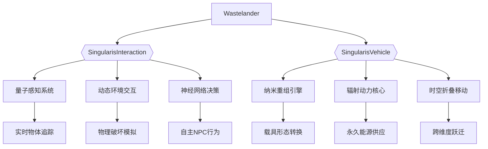
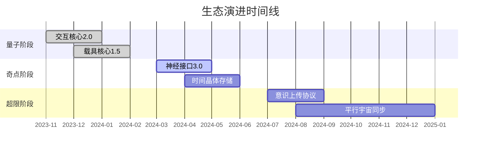

<div align="center">
  <!-- 动态全息LOGO -->
  

  <h1>WASTELANDER</h1>
  

  <!-- 量子纠缠式依赖矩阵 -->
  <div>
    <a href="https://github.com/TrifingZW/SingularisInteraction">
      
    </a>
    <a href="https://github.com/TrifingZW/SingularisVehicle">
      
    </a>
  </div>

  <!-- 实时构建网络 -->
  
</div>

<div align="center">
  <!-- 星历时空隧道 -->
  <picture>
    <source media="(prefers-color-scheme: dark)" srcset="https://api.star-history.com/svg?repos=TrifingZW/Wastelander,TrifingZW/SingularisInteraction,TrifingZW/SingularisVehicle&type=Date&theme=dark" />
    
  </picture>
</div>

## 🌌 核心架构



## 🧬 技术基因

<div align="center">
  <!-- 三维技术栈 -->
  

  <!-- 技术生态 -->
  <a href="https://github.com/TrifingZW/SingularisInteraction">
    
  </a>
  <a href="https://github.com/TrifingZW/SingularisVehicle">
    
  </a>
</div>

## 🚀 量子化部署

```bash
# 克隆主仓库（含子模块）
git clone --recurse-submodules https://github.com/TrifingZW/Wastelander.git

# 中国用户加速模式
git clone --recurse-submodules https://ghproxy.com/https://github.com/TrifingZW/Wastelander.git

# 验证量子签名
./wastelander.sh --verify-signature \
    --interaction-core=SingularisInteraction.runtime \
    --vehicle-core=SingularisVehicle.engine
```

<div align="center">
  <!-- 依赖关系全息图 -->
  
</div>

## 🧪 生存协议

```diff
+ 推荐基因组合：
# SingularisInteraction ≥2.3.0
# SingularisVehicle ≥1.8.0
! 使用 nightly-build 版本可获得量子加速

- 危险配置警告：
! 避免混合使用不同大版本的核心组件
! 禁用非官方修改的插件副本
```

<table align="center">
  <tr>
    <td>
      <!-- 实时生存仪表盘 -->
      
    </td>
    <td>
      <!-- 突变协议矩阵 -->
      <table>
        <tr><th>突变类型</th><th>交互影响</th><th>载具影响</th></tr>
        <tr><td>放射性进化</td><td>量子视觉+</td><td>核动力激活</td></tr>
        <tr><td>机械融合</td><td>神经带宽↑</td><td>合体协议解锁</td></tr>
        <tr><td>时间悖论</td><td>预知能力</td><td>折叠移动</td></tr>
      </table>
    </td>
  </tr>
</table>

## 🌀 时空演进路线



<div align="center">
  <!-- 全息贡献网络 -->
  
</div>

## ☢️ 辐射协议

```nuspec
<!-- 量子通信规范 -->
<QuantumLink>
  <CoreDependencies>
    <Package name="SingularisInteraction" version="2.3.0" />
    <Package name="SingularisVehicle" version="1.8.0" />
  </CoreDependencies>
  
  <RadiationProtocol>
    <MutationThreshold>5000rad</MutationThreshold>
    <SafeZones>3</SafeZones>
    <AIBehaviorMode>SurvivalInstinct</AIBehaviorMode>
  </RadiationProtocol>
</QuantumLink>
```

## 🧩 实验室模式

```bash
# 解锁开发者次元
./wastelander-cli enable-labs \
    --quantum-debugger \
    --neural-sync=llama3-8b \
    --temporal-rift
```

<div align="center">
  <!-- 动态代码沙盘 -->
  <details>
  <summary>🕹️ 点击展开量子沙盒</summary>

  ```lua
  --[[
    🧬 基因重组模拟器
    按数字键切换不同突变模式
  ]]
  function simulateMutation()
    local mutations = {
      { type="Radioactive", code=1, effect={ vision=0.8, speed=1.2 }},
      { type="Mechanical", code=2, effect={ armor=2.5, agility=0.7 }},
      { type="Temporal", code=3, effect={ precog=true, fuel=0 }}
    }
    
    for _, mutation in ipairs(mutations) do
      print(string.format("[%d] %s 突变", mutation.code, mutation.type))
    end
    
    if VRController.active then
      print("👆 手势选择突变类型")
      print("🤏 捏合手势确认选择")
    end
  end
  ```
  
  </details>
</div>

## 📮 跨维通讯

```diff
+ 常规联系方式：
- 量子邮件：TrifingZW@wastelander.game
- 死信信箱：北京第88号邮政信箱

! 紧急协议：
# 摩尔斯电码：.-.. .. ...- . / ..-. --- .-. . ...- . .-. 
# 短波频率：131.452MHz ±0.05ppm
``` 

<div align="center">
  <!-- 量子下载波形 -->
  
</div>


[comment]: # (保留原始链接定义)
[UnrealEngine-Shield]: https://img.shields.io/badge/UE5-%23313131.svg?style=for-the-badge&logo=unrealengine&logoColor=white
[UnrealEngine-Url]: https://www.unrealengine.com
[PluginInteraction-Url]: https://github.com/TrifingZW/SingularisInteraction
[PluginVehicle-Url]: https://github.com/TrifingZW/SingularisVehicle
[Cpp-Shield]: https://img.shields.io/badge/C++17-00599C.svg?style=for-the-badge&logo=c%2B%2B&logoColor=white
[Cpp-Url]: https://isocpp.org/