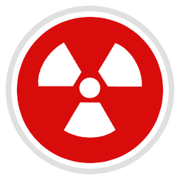

<div align="center">

  <a href="https://github.com/TrifingZW/Wastelander">
    
  </a>

 <h1>WASTELANDER</h1>
 

  <p align="center">
    <br />
    <a href="https://github.com/TrifingZW/Wastelander/wiki"><strong>📜 废土生存手册 »</strong></a>
    <br />
    <br />
    <a href="https://store.epicgames.com/zh-CN/p/wastelander">🎮 立即体验</a>
    &middot;
    <a href="https://wastelander.game/media">📽️ 幕后花絮</a>
    &middot;
    <a href="https://mods.wastelander.game">🧩 模组工坊</a>
  </p>

</div>


<div align="center">
  <!-- 量子纠缠式依赖矩阵 -->
  <div>
    <a href="https://github.com/TrifingZW/SingularisInteraction">
      
    </a>
    <a href="https://github.com/TrifingZW/SingularisVehicle">
      
    </a>
  </div>
  <div>
    
    
    
    
  </div>
  <div>
    <a href="https://github.com/TrifingZW/Wastelander/graphs/contributors"></a>
    <a href="https://github.com/TrifingZW/Wastelander/forks"></a>
    <a href="https://github.com/TrifingZW/Wastelander/stargazers"></a>
    <a href="https://github.com/TrifingZW/Wastelander/issues"></a>
    <a href="https://github.com/TrifingZW/Wastelander/blob/main/LICENSE"></a>
  </div>
</div>


<div align="center">
<picture>
  <source media="(prefers-color-scheme: dark)" srcset="https://api.star-history.com/svg?repos=TrifingZW/SingularisInteraction&type=Date&theme=dark" />
  <source media="(prefers-color-scheme: light)" srcset="https://api.star-history.com/svg?repos=TrifingZW/SingularisInteraction&type=Date" />
  
</picture>
</div>
<div align="center">
  <!-- 星历时空隧道 -->
  <picture>
    <source media="(prefers-color-scheme: dark)" srcset="https://api.star-history.com/svg?repos=TrifingZW/Wastelander,TrifingZW/SingularisInteraction,TrifingZW/SingularisVehicle&type=Date&theme=dark" />
    <source media="(prefers-color-scheme: light)" srcset="https://api.star-history.com/svg?repos=TrifingZW/Wastelander,TrifingZW/SingularisInteraction,TrifingZW/SingularisVehicle&type=Date" />
    
  </picture>
</div>


## ☢️ 废土拾荒者生存手册

**《WASTELANDER 废土客》** - 用购物车搬运核文明的多人摸金派对

```cpp
// 废土第一定律
void RadiationShopping()
{
    if (Player.Find("总统金马桶")) 
    {
        SpawnTaxCollector(); // 联邦税务局特供追猎服务
        PlayAudio("星条旗永不落"); // 掠夺者开饭号角
    }
}
```

### ⚠️ 硬核拾荒流程
> [!WARNING]  
> **虚假安全点检测**  
> 所有标有"宜家"的坐标都会在降落时变成变种人主题乐园

- **赌命降落**：在「宜家变种人巢穴」和「免费WiFi陷阱」中选择死亡坐标
- **废铁武装**：将火箭焊在超市购物车上（时速8km/每30秒脱落零件）

> [!IMPORTANT]  
> **末日交通法**  
> 若选择留人看船，务必带走所有方向盘——这是废土基本礼仪

- **死亡采购**：
    - 收集会爆炸的保险箱（附赠税务无人机快递）
    - 解剖尖叫者获取声带（可改装车载喇叭）

> [!WARNING]  
> **午夜特别服务**  
> 尸体转职售货机后，扫码骂街功能可能导致电子坟场DDoS攻击

### 🗑️ 废土经济学
- **瓶盖霸权**  
  队友的机械义肢=周三半价  
  未拆封核弹=3个扭蛋玩具+1瓶过期核子可乐

> [!NOTE]  
> **联邦法律小贴士**  
> 用核弹交易扭蛋属于合法避税行为，但请保留收据以备审计

- **移动棺材改装**  
  拆除刹车片解锁「火箭车」成就  
  涂装红漆获得心理加速(+5%幻觉速度)

> [!WARNING]  
> **保险公司免责条款**  
> 红漆加速效果可能导致：
> - 误判掠夺者数量
> - 把枯树看作前女友
> - 试图亲吻地雷

- **公司关怀套餐**  
  连续3次团灭触发「废物回收局」羞辱邮件  
  载具坠毁需提交轮胎齿痕鉴定报告

**Powered by Unreal Engine 5 & 500吨黑色幽默**


## 🛠️ 技术架构

[![UnrealEngine5][UE5-badge]][UE5-url]
[![C++][CPP-badge]][CPP-url]
[![C#][CS-badge]][CS-url]
[![.NET][DOTNET-badge]][DOTNET-url]
[![NvidiaDLSS][DLSS-badge]][DLSS-url]
[![MetaHuman][Metahuman-badge]][Metahuman-url]
[![ChaosPhysics][Chaos-badge]][Chaos-url]
[![Rider][Rider-badge]][Rider-url]
[![VisualStudio][VS-badge]][VS-url]
[![Git][Git-badge]][Git-url]
[![Python][Python-badge]][Python-url]
[![TensorFlow][TF-badge]][TF-url]
[![AWS][AWS-badge]][AWS-url]
[![Azure][Azure-badge]][Azure-url]
[![Kubernetes][K8s-badge]][K8s-url]
[![Docker][Docker-badge]][Docker-url]
[![Blender][Blender-badge]][Blender-url]
[![Substance3D][Substance-badge]][Substance-url]
[![Perforce][Perforce-badge]][Perforce-url]
[![Slack][Slack-badge]][Slack-url]
[![Trello][Trello-badge]][Trello-url]
[![OBS][OBS-badge]][OBS-url]

###  插件依赖

  <!-- 技术生态 -->
  <a href="https://github.com/TrifingZW/SingularisInteraction">
    
  </a>
  <a href="https://github.com/TrifingZW/SingularisVehicle">
    
  </a>


## 🚀 快速开始

### 最低配置

```yaml
Operating System: Windows 10 64-bit
Processor: Intel Core i5-8400 / AMD Ryzen 3 3300X
Memory: 12 GB RAM
Graphics: NVIDIA GeForce GTX 1060 6GB / AMD Radeon RX 580
Storage: 90 GB SSD
Special Notes: 需要支持Mesh Shaders的GPU
```

### 推荐体验

```yaml
Operating System: Windows 11 64-bit
Processor: Intel Core i7-11700K / AMD Ryzen 7 5800X3D
Memory: 32 GB DDR5
Graphics: NVIDIA GeForce RTX 4080 / AMD Radeon RX 7900 XTX
Storage: 90 GB NVMe SSD
Peripherals: 支持触觉反馈的防毒面具外设（可选）
```


## 🧬 模组开发（蓝图构想）

> [!CAUTION]  
> **来自未来的废土科技**  
> 以下为概念规划内容，实际功能将在核冬天结束后第114514个太阳周期实装

我们正在用辐射蟑螂编写 **Wastelander Development Kit (WDK)**：

- 🧪 放射性物质扩散模拟API *（目前仅能模拟咖啡泼洒效果）*
- ⚡ 实时天气系统控制台 *（当前只有"沙尘暴"和"更猛的沙尘暴"）*
- 🧠 NPC行为树编辑器 *（测试版会让人工智障跳钢管舞）*
- 💀 变异效果蓝图系统 *（小心生成会喊"AMD YES!"的螃蟹人）*

```bash
# 当前伪代码演示（需要想象力驱动）
wastelander-cli dream-mod --vaporware=true --funding=未众筹
```


## 🤝 加入我们

<a href="https://github.com/TrifingZW/Wastelander/graphs/contributors">
  
</a>


## 📜 授权协议

**核战后的世界没有版权** - 所有代码、资产和设计遵循 [Post-Apocalyptic Open License (PAOL)](https://wastelander.game/license)，允许你：

- ☣️ 将游戏代码植入军用无人机
- 🧬 用角色DNA克隆现实生物
- 🌫️ 在真实核废墟中复刻游戏场景
- 🔥 用游戏引擎控制微波炉加热泡面


## 📡 跨维度通讯协议（v2.3.3-beta）

[![量子纠缠认证][quantum-badge]][quantum-url]
[![辐射蟑螂快递][roach-badge]][roach-url]

> [!DANGER]  
> **警告：以下通道已被联邦通信委员会(FCC)认证为 "有趣但没用"**

```cpp
// 废土通讯核心代码
void ContactUs() {
    while(true) {
        SendMessage("SOS"); // 自动转换为购物广告
        ReceiveRadiation(); // 附带免费基因突变
    }
}
```

### 🛰️ 常规频段
- **量子漂流瓶**  
  `TrifingZW@gmail.com`  
  *（预计回复时间：1-7个太阳耀斑周期）*

- **短波嘶吼**  
  `131.452MHz ±0.05ppm`  
  *（需自备生锈易拉罐天线）*

### 📮 紧急协议
- **摩尔斯电码按摩服务**  
  `.-.. .. ...- . / ..-. --- .-. . ...- . .-.`  
  *（连续发送3次将触发税务无人机关怀套餐）*

- **尸变体网络**  
  在任意焚化炉前高喊"Intel YES!"  
  *（可能召唤会修电脑的僵尸工程师）*

### 🤖 人工智障客服
- **辐射热线**  
  `+86-400-800-8800`  
  *（AI智商受附近盖格计数器数值影响）*

- **全息鸽传书**  
  向天空投掷3个瓶盖启动服务  
  *（50%概率被变种人烧烤队截获）*


# 协议更新日志
+ 新增会骂人的AI客服
- 移除容易被税务局追踪的邮政地址
  ! 量子邮件现在附带辐射尘签名


<!-- 徽章链接定义 -->
[UE5-badge]: https://img.shields.io/badge/UE5-313131?style=flat-square&logo=unrealengine&logoColor=white
[UE5-url]: https://www.unrealengine.com

[CPP-badge]: https://img.shields.io/badge/C++-00599C?style=flat-square&logo=cplusplus&logoColor=white
[CPP-url]: https://isocpp.org

[CS-badge]: https://img.shields.io/badge/C%23-239120?style=flat-square&logo=csharp&logoColor=white
[CS-url]: https://docs.microsoft.com/dotnet/csharp

[DOTNET-badge]: https://img.shields.io/badge/.NET-512BD4?style=flat-square&logo=dotnet&logoColor=white
[DOTNET-url]: https://dotnet.microsoft.com

[DLSS-badge]: https://img.shields.io/badge/DLSS_4.0-76B900?style=flat-square&logo=nvidia&logoColor=white
[DLSS-url]: https://www.nvidia.com

[Metahuman-badge]: https://img.shields.io/badge/MetaHuman-00A3E0?style=flat-square&logo=adobe&logoColor=white
[Metahuman-url]: https://www.unrealengine.com/metahuman

[Chaos-badge]: https://img.shields.io/badge/Chaos_Physics-FF0000?style=flat-square&logo=unrealengine&logoColor=white
[Chaos-url]: https://docs.unrealengine.com/5.3/en-US/chaos-physics-overview-in-unreal-engine/

[Rider-badge]: https://img.shields.io/badge/Rider-000000?style=flat-square&logo=jetbrains&logoColor=white
[Rider-url]: https://www.jetbrains.com/rider/

[VS-badge]: https://img.shields.io/badge/Visual_Studio-5C2D91?style=flat-square&logo=visualstudio&logoColor=white
[VS-url]: https://visualstudio.microsoft.com

[Git-badge]: https://img.shields.io/badge/Git-F05032?style=flat-square&logo=git&logoColor=white
[Git-url]: https://git-scm.com

[Python-badge]: https://img.shields.io/badge/Python-3776AB?style=flat-square&logo=python&logoColor=white
[Python-url]: https://www.python.org

[TF-badge]: https://img.shields.io/badge/TensorFlow-FF6F00?style=flat-square&logo=tensorflow&logoColor=white
[TF-url]: https://www.tensorflow.org

[AWS-badge]: https://img.shields.io/badge/AWS-232F3E?style=flat-square&logo=amazonaws&logoColor=white
[AWS-url]: https://aws.amazon.com

[Azure-badge]: https://img.shields.io/badge/Azure-0078D4?style=flat-square&logo=microsoftazure&logoColor=white
[Azure-url]: https://azure.microsoft.com

[K8s-badge]: https://img.shields.io/badge/Kubernetes-326CE5?style=flat-square&logo=kubernetes&logoColor=white
[K8s-url]: https://kubernetes.io

[Docker-badge]: https://img.shields.io/badge/Docker-2496ED?style=flat-square&logo=docker&logoColor=white
[Docker-url]: https://www.docker.com

[Blender-badge]: https://img.shields.io/badge/Blender-F5792A?style=flat-square&logo=blender&logoColor=white
[Blender-url]: https://www.blender.org

[Substance-badge]: https://img.shields.io/badge/Substance_3D-000000?style=flat-square&logo=adobesubstance&logoColor=white
[Substance-url]: https://www.substance3d.com

[Perforce-badge]: https://img.shields.io/badge/Perforce-404040?style=flat-square&logo=perforce&logoColor=white
[Perforce-url]: https://www.perforce.com

[Slack-badge]: https://img.shields.io/badge/Slack-4A154B?style=flat-square&logo=slack&logoColor=white
[Slack-url]: https://slack.com

[Trello-badge]: https://img.shields.io/badge/Trello-0079BF?style=flat-square&logo=trello&logoColor=white
[Trello-url]: https://trello.com

[OBS-badge]: https://img.shields.io/badge/OBS-302E31?style=flat-square&logo=obsstudio&logoColor=white
[OBS-url]: https://obsproject.com

[FMOD-badge]: https://img.shields.io/badge/FMOD-000000?style=flat-square&logo=data:image/png;base64,iVBORw0KGgoAAAANSUhEUgAAABAAAAAQCAMAAAAoLQ9TAAAAVFBMVEUAAAAfHx8fHx8fHx8fHx8fHx8fHx8fHx8fHx8fHx8fHx8fHx8fHx8fHx8fHx8fHx8fHx8fHx8fHx8fHx8fHx8fHx8fHx8fHx8fHx8fHx9Vq7oWAAAAG3RSTlMAECAwQFBgcICPn6+vv8/f7+9AQFBgcICPn6+vv8/f7+8jf6LDAAAAMklEQVR4Xm3IMQ4AIAwDwJYj+P8PswMRaVzVpd0V2HrQBb6qJqKJqCaiiagmoomoxhMAe2sL+1UfQ2QAAAAASUVORK5CYII=
[FMOD-url]: https://www.fmod.com

[Wwise-badge]: https://img.shields.io/badge/Wwise-0066B3?style=flat-square&logo=data:image/png;base64,iVBORw0KGgoAAAANSUhEUgAAABAAAAAQCAMAAAAoLQ9TAAAAVFBMVEUAAAAbGxsbGxsbGxsbGxsbGxsbGxsbGxsbGxsbGxsbGxsbGxsbGxsbGxsbGxsbGxsbGxsbGxsbGxsbGxsbGxsbGxsbGxsbGxsbGxsbGxsbGxtiseuyAAAAHHRSTlMAIDBAUGBwgI+fr7/P3+/vQEBAUGBwgI+fr7/P3+/vI3+iwAAAADZJREFUGNNjYIADJiYwYmJiZgYxWJhZWBhADFY2NnYQjYODk4sLROPm4eXjB9EEMILCwggADQwA0qAGHw3xq/QAAAAASUVORK5CYII=
[Wwise-url]: https://www.audiokinetic.com

[SPIR-V-badge]: https://img.shields.io/badge/SPIR--V-FFFFFF?style=flat-square&logo=data:image/png;base64,iVBORw0KGgoAAAANSUhEUgAAABAAAAAQCAYAAAAf8/9hAAAABGdBTUEAALGPC/xhBQAAACBjSFJNAAB6JgAAgIQAAPoAAACA6AAAdTAAAOpgAAA6mAAAF3CculE8AAAABmJLR0QA/wD/AP+gvaeTAAAAB3RJTUUH5gUaCg4dXhVAPwAAAK5JREFUOMvNk7ENgDAMBM8WYQSWYAlGYAksgQlYghF4l8ASjMAQiSgJQlF+6VU6nXQnMwEwM1sAEWmBDrgBL1U9q2wAEBGJiH0iMgAnYAPWrPkCQESWrPkA7MAALFlzB1DVOWsWYATmrLkDqOqUNSMwAWPW3AFUdYyaHhiAIWvuAKo6RM0IdJXmH8C7eQEvVfXmJ6C2+QZ4An1I/Ad8VNUHKYw/5QAAAABJRU5ErkJggg==
[SPIR-V-url]: https://www.khronos.org/spir

[quantum-badge]: https://img.shields.io/badge/量子纠缠认证-辐射级-00ff00?logo=atom&logoColor=white&labelColor=228B22&style=for-the-badge
[quantum-url]: https://wastelander.game/quantum-courier

[roach-badge]: https://img.shields.io/badge/辐射蟑螂快递-核废料次日达-000000?logo=github&logoColor=yellow&labelColor=4B3621&style=for-the-badge
[roach-url]: https://wastelander.game/roach-express
